# 家电之选在线商城

---

## 项目说明

家电之选项目源于《拜客商城系统》（https://gitee.com/bayke/bayke-shop/tree/master），原项目采用Django-RestFramework框架开发，而本项目完全使用Django原生框架开发，语法简洁，通俗易懂。前端采用vue框架，使得网页变得更具互动性和动态性。后端采用Django-MTV设计模式，符合传统Web开发规范，适合中等偏下级别的程序员学习和开发。

*说明：本项目实现了原项目的百分之九十的功能，并在原有的功能上新增额外功能。*


## 项目开发环境

Python3.11，Django4.1，Mysql8.0


## 项目环境配置

1. 进入requirements.txt文件对应的目录下面，将该项目所依赖的包安装好。

```python
pip install -r requirements.txt
```

2. 创建相应的数据库并在settings文件里面配置对应的数据库信息。

```python
DATABASES = {
    "default": {
        "ENGINE": "django.db.backends.mysql",
        "NAME": '',  # 你的数据库的名称
        "USER": '',  # 你的数据库的账号
        "PASSWORD": '',  # 你的数据库的密码
        "PORT": '3306',
        "HOST": 'localhost',
        'OPTIONS': {
            'isolation_level': 'read committed',  # 设置Mysql事务隔离级别为'read committed'
            "init_command": "SET foreign_key_checks = 0;",  # 迁移数据库时取消外键检查
        }
    }
}
```

3. 配置好发送邮箱信息。

```python
EMAIL_BACKEND = 'django.core.mail.backends.smtp.EmailBackend'
EMAIL_HOST = 'smtp'  # 你所用的邮箱的smtp地址，这里是网易邮箱的
EMAIL_PORT = 25  # 你所用邮箱的端口号，这里时网易邮箱的
EMAIL_HOST_USER = ''  # 你的邮箱账号
EMAIL_HOST_PASSWORD = ''  # 你的邮箱授权码
EMAIL_FROM = ''  # 发件者信息，没有就填邮箱账号
```

4. 在manage.py所对应的目录下执行迁移命令。

```python
python manage.py makemigrations
python manage.py migrate
```

5. 迁移完毕后执行项目目录下的几个sql文件，向数据库中插入对应的商品数据。
6. 创建超级管理员，按照提示完成即可。

```python
python manage.py createsuperuser
```

7. 执行完上述操作以后就可以启动项目了。

```python
python manage.py runserver
```


##  项目模块划分

- ####  用户模块

  - #####  注册页面

  - ##### 登录页面

  - ##### 用户中心页面

  - ##### 用户余额页面

  - ##### 用户地址页面

  - ##### 历史订单页面

  - ##### 订单详情页面

  - ##### 用户更改头像功能

  - ##### 充值功能（非正式功能）

- #### 商品模块

  - ##### 商品首页

  - ##### 商品详情页

  - ##### 商品列表页

  - ##### 商品搜索功能

- ####  购物车模块

  - ##### 购物车页面（购物车商品数量、删、改）

  - ##### 加入购物车功能

- ####  订单模块

  - ##### 订单页面

  - ##### 支付页面

  - ##### 支付成功页面

  - ##### 订单评价页面


## 项目部分功能展示

注册页面
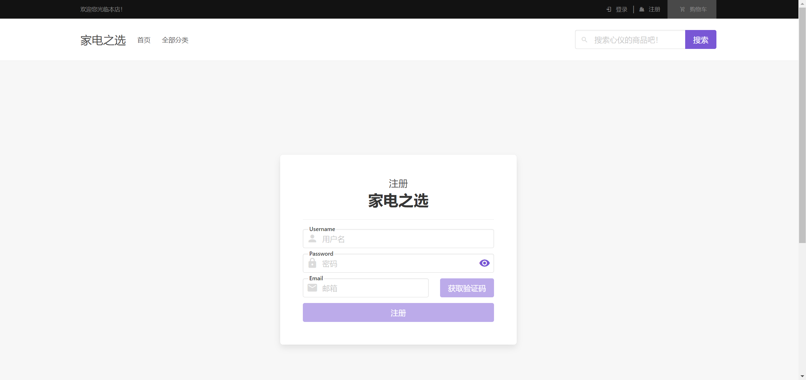

登录页面

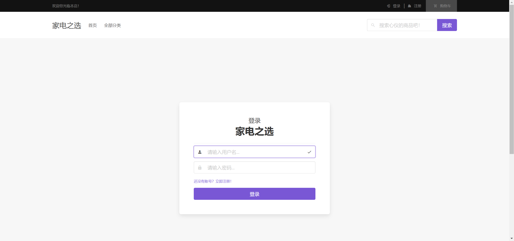

用户个人中心页面


用户余额页面


用户收货地址页面

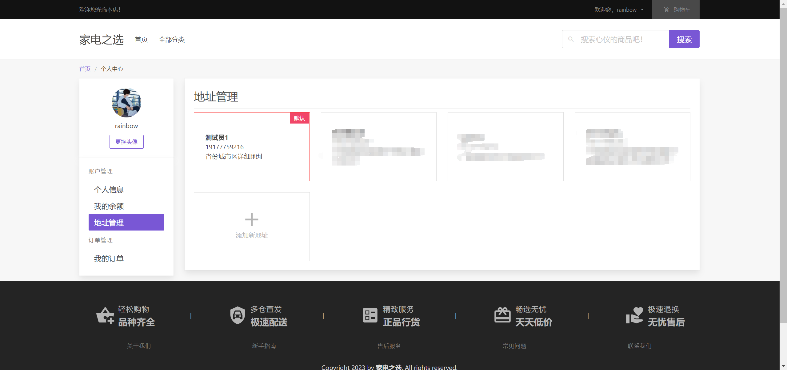

用户历史订单页面

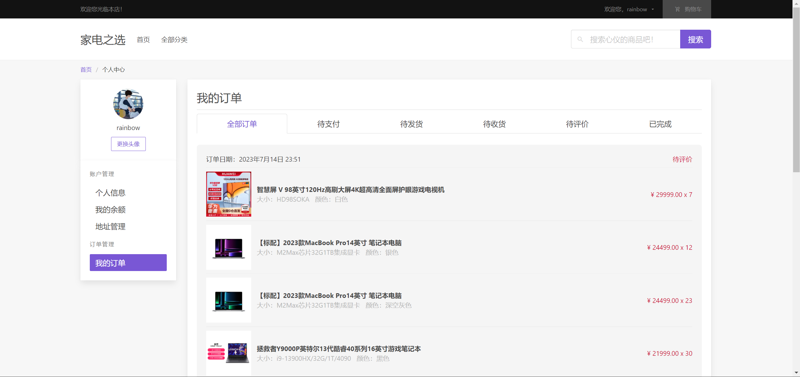

订单评价页面

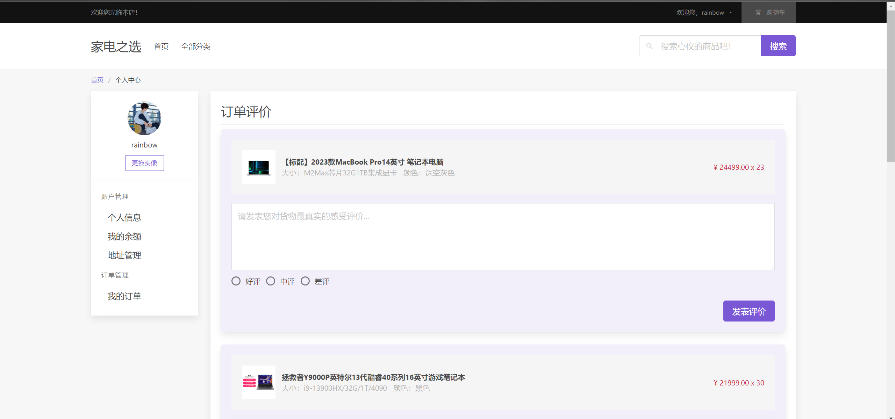

订单详情页面

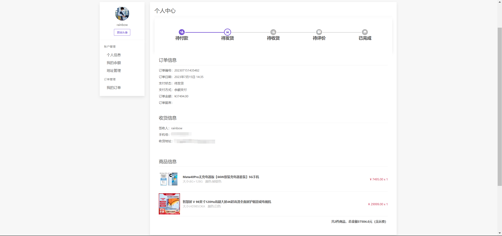

购物车页面

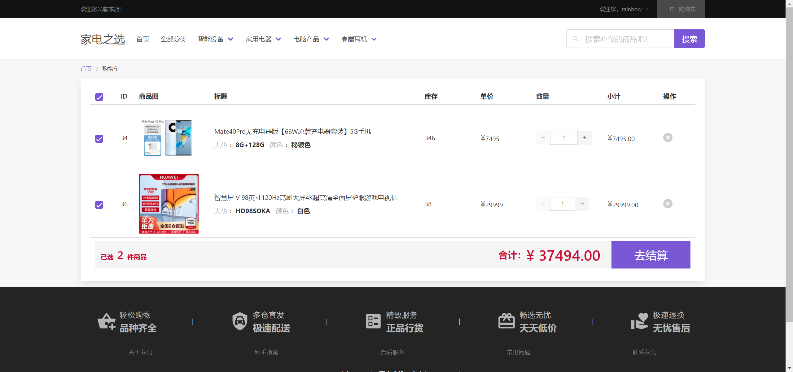

订单页面


商品列表页面

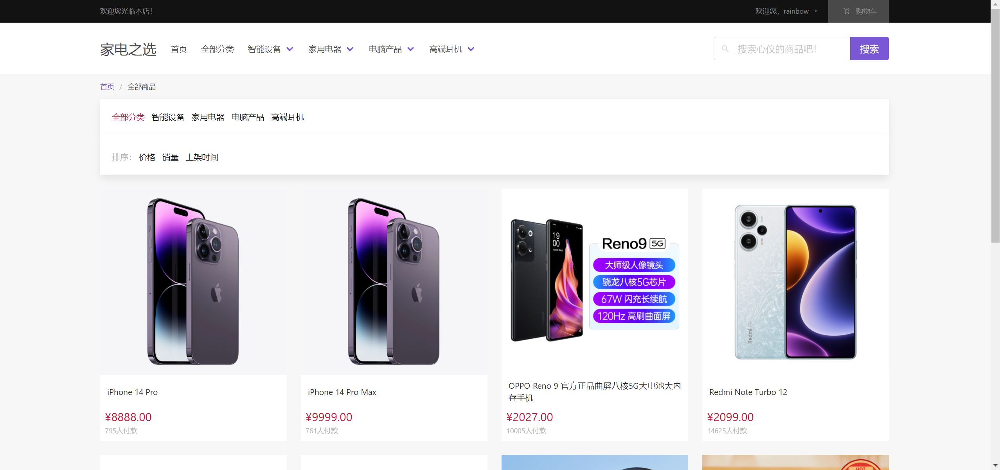

商品详情页面


首页一

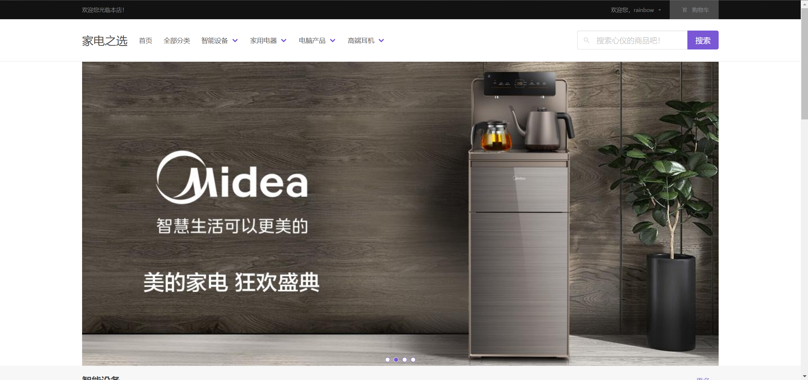

首页二


首页三

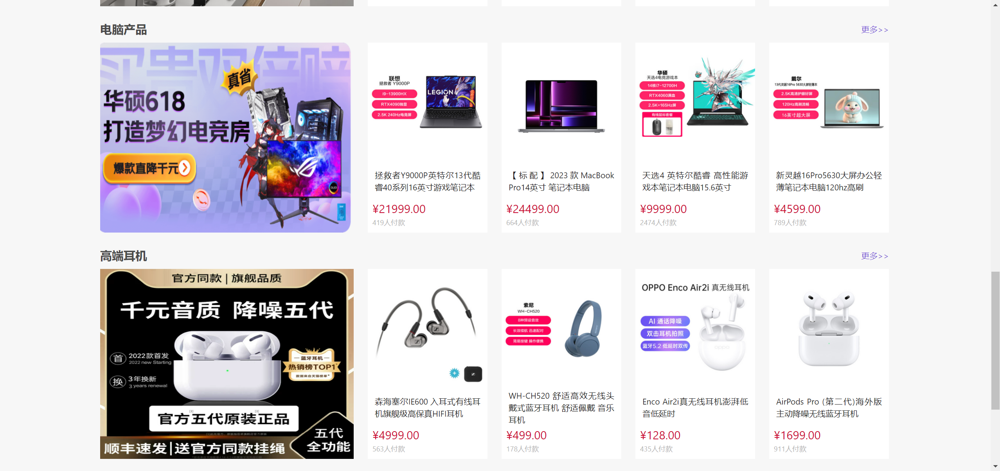

支付页面


支付成功页面


##  数据库模型设计

- ### 用户模型

​	用户模型只包括两个模型类，一个是MyUser，一个是Address，前者继承并拓展了Django自带的	用户模型类，用于储存用户信息，后者用于储存用户的收货地址。

- ### 商品模型

1. GoodsType（商品类型表）：记录所有商品的类型。

2. GoodsImage（商品图片表）：记录每个商品动态的图片。

3. GoodsSPU（商品SPU表）：商品SPU。

4. GoodsSKU（商品SKU表）：商品SKU。

5. GoodsDynamics（商品动态表）：商品动态表存储的是商品的价格、库存、销量、大小、颜色等，关联于商品SKU表。

6. GoodsComment（商品评论表）：主要存储用户对该商品的评价以及满意程度、关联于商品订单表、商品SKU表、	用户表。

7. RotationCharts（首页轮播图表）：哪张图片需要轮播，哪张图片不需要轮播。

- ### 订单模型

​	订单模型主要分为：（OrderInfo）订单信息表和（GoodsOrder）商品订单表。

​	订单信息表：主要存储订单的编号（订单ID）和交易的编号，以及该订单的商品总数和总金额，关联的用户和用户地址	等。

​	商品订单表：主要存储某商品的交易总数、交易总价等。


## 缓存后端的使用

在数据库模型类的说明中，没有提到购物车的模型类，这是因为购物车是一个频繁访问数据库的操作，而对于传统的Mysql数据库来说，频繁的访问数据库无疑会对数据库造成巨大的压力。因此本项目采用缓存后端来存储购物车信息。

在项目总目录中的settings文件里面的配置如下：

```python
CACHES = {
    'default': {
        'BACKEND': 'django_redis.cache.RedisCache',
        'LOCATION': 'redis://127.0.0.1:6379/9',  # 使用redis服务器中的第9个数据库
        'OPTIONS': {
            'CLIENT_CLASS': 'django_redis.client.DefaultClient'
        }
    }
}
# 为了确保能够正常使用Redis作为Django的缓存后端，请仔细确认在本地已经开启了Redis的服务。
```

redis是一个非关系小型数据库，很擅长频繁的读取数据，换句话说，redis不怎么适合数据持久化，它更适合用于一个网站的缓存后端，即把需要频繁访问的数据存入redis中，以此来应对高并发场景，例如商品秒杀、标题热搜等。

在本项目的购物车业务中，主要用django-redis来操作redis。存储的数据结构选择的是哈希存储，即每个用户id对应一条数据。例如：{'用户id': {'商品id': '商品数量'}}。

涉及到的方法有：hget（获取用户购物车中某个商品的数量）、hset（增添或覆盖某个商品的数量）、hlen（用户购物车商品总条数）、hgetall（返回所有商品的id、数量）、hdel（清除该购物车的数据）。

*拓展知识：虽然本项目中没有涉及，但是在一个电商平台中，用户的历史浏览记录也是必不可少的，对于历史浏览记录来说，同样也是一个频繁访问数据库的操作，因此历史浏览记录也应该使用redis来存储，但是对于数据结构的选择，这里应该使用列表来存储，即双向链表，例如：{'用户id': [浏览记录1, 浏览记录2...]}。但是历史浏览记录通常会优先显示近期浏览的商品，因此正确的数据结构应该是：{'用户id': [浏览记录2, 浏览记录1...]}。*


## 订单并发场景

对于一些节假日来说，特别是双11、618等这些促销活动很频繁的节日，商家无疑会对某些或者某一类商品进行降价秒杀，那么无疑会有大量的用户集中购买某个商品，这样就会出现订单并发的场景。

对于订单并发场景，只需要对订单加上相应的锁就可以了，也就是说，在出现订单并发的场景中，我们只需要将某一个商品加上一把锁，当某个用户拿到这把锁的时候，才能对该商品进行操作，否则所有没有拿到锁的用户都需要排队等待前面一位用户下单完毕后，才有机会操作该商品。例如：有两个用户正在购买同一个商品，但是用户1先提交了订单的页面，也就是说用户1先拿到这把锁，若该商品只剩一件，那么这一件商品就归为用户1，那么此时商品的库存就变成了0件，在排队的用户2也就无法购买该商品了（悲观锁）。对于订单锁，这里可以分为两种：乐观锁和悲观锁。

### 悲观锁

当有多个用户操作一条数据的时候，可以用一把锁将该条数据锁住，也就是说，只有拿到了这把锁的用户，才能对这这条数据进行操作，否则所有用户都需要等到前面一位用户操作完该数据的时候才能对该数据进行操作。在Mysql中，提供了一种简单的锁，也可以达到这种目的，用sql语句来说，悲观锁就为以下：

```mysql
select * from table where id=id for update;
```

当使用Django来操作数据库的时候，就是以下语句：

```python
模型类名.objects.select_for_update().get(id=id)
```

### 乐观锁

乐观锁并不是实际意义上的锁，只是它的步骤相当于一把锁。

现在有一个场景：现在有用户1和用户2在同时操作同一个商品，但是商品的库存只有一件。现在，我们让两个用户同时操作该商品，也就是说，两个用户都可以操作这条数据。此时我们需要先记录该商品的库存，用户1和用户2拿到的库存都是1，接着程序继续往下执行，当代码执行到提交订单的那一行之前，我们加上一个判断，这个判断就是：再向数据库中查询一次该商品的库存，如果第二次查询到的库存与第一次拿到的库存一致，那么就说明没有其他用户跟我竞争该商品，我可以正常提交订单；如果第二次查询到的库存与第一次的库存不一致，那么就说明有其他用户在和我竞争该商品，那么就不能正常提交订单。当用户1比用户2先提交订单，那么商品库存减少为0，用户2在提交订单之前查询库存与第一次查询到的库存不一致，那么该订单下单失败。

对于第二种情况，也就是第二次查询到的商品库存与第一次的不一致，订单失败。对于这种情况，我们通常给用户四次机会来尝试下单，也就是说，当用户第一次下单失败的时候，会进入一个循环操作，循环有三次。当用户进入第一次循环的时候，如果判断的库存还是不一样，那么进入第二次循环，直至三次循环机会全部用完，用户还是没有得到正确的数据，那么才判定该用户下单失败。倘若三次循环中有一次得到的是正确的数据，那么该用户则下单成功。

我们也可以用sql语句来描述判断库存的情况：

```sql
select * from table set stock=new_stock where id=id stock=origin_stock
```

翻译成Django语句就是：

```python
模型类名.objects.filter(id=id, stock=origin_stock).update(stock=new_stock, sales=new_sales)
```

这样会返回受影响的行数，也就是说，不是返回1就是返回0。如果受影响的行数为1，那么用户下单成功，反之则下单失败。

### 订单并发总结

1. 不管是乐观锁还是悲观锁，都存在一个运气的成分在里面。
2. 乐观锁适合低并发的场景（高并发会存在大量的循环操作，增加资源的损耗）。
3. 悲观锁适合高并发的场景。
4. 对于更高级别的并发场景，普通的悲观锁也不适合了，这时候需要用到分布式锁。


## Mysql中事务的使用

在了解事务之前，我们先看一个简单的生活实例：在微信中，当我们向一个朋友转账的时候，我的钱刚被扣完，但是，我的手机断网了，而且朋友那边也没有收到相应的汇款，那么问题来了，钱包的钱到底会不会扣呢？答案是你的朋友没有收到钱是正常的，但是你钱包里的钱也会保持原原本本的数量，不会发生任何变化。那么没有扣钱这件事就是事务造成的。

### 事务的四大特性（ACID）

1. 原子性（Atomicity）：原子是不可再分割的最小粒子，也就是说，把一组操作看成是一个事务，那么这组操作的所有子操作要么全部成功，要么全部不成功。
2. 一致性（Consistency）：指的是对数据操作的规则，在事务的前后必须保持一致。
3. 隔离性（Isolation）：一个事务不会影响另一个事务的进行。
4. 持久性（Durability）：当一个事务提交之后，将不能撤销。

### 事务的执行流程

1. 开启事务（start transaction）
2. 执行相应的sql语句
3. 若执行期间没有异常，那么则提交（commit）；否则所有操作回滚（rollback）到之前。

*若需要用到事务，那么必须保证在创建数据表的时候，需要选择Innodb引擎，事务才能正常使用，在Mysql中，事务的默认开启的。*

在Django中需要正常使用Mysql的事务，需要在settings文件中做以下配置：

```python
DATABASES = {
    "default": {
        "ENGINE": "django.db.backends.mysql",
        "NAME": 'home_appliances',
        "USER": 'root',
        "PASSWORD": '000000',
        "PORT": '3306',
        "HOST": 'localhost',
        'OPTIONS': {
            'isolation_level': 'read committed',  # 设置Mysql事务隔离级别为'read committed'
            "init_command": "SET foreign_key_checks = 0;",  # 迁移数据库时取消外键检查
        }
    }
}
```

在OPTIONS的选项中，需要设置Mysql的事务隔离级别为‘read committed’，不然有时候会导致一些数据的丢失（Django官方文档的原话）。

那么此时再回到订单的场景，假设用户在下单的时候发生了异常，比如断网或者代码异常等等，那么此时又为用户创建了相应的订单，这是不可取的。因此在用户下单的时候，我们应该启用事务来保证操作的完整性。

### 在Django中开启事务

Django为开发者提供了相应的模块来操作事务：

1. 首先需要导入相应的模块。

```python
from django.db import transaction
```

2. 在需要开启事务的函数上面加上事务装饰器，以说明该函数需要开启事务

```python
@transaction.atomic  # 绑定事务
def post(request):
    pass
```

3. 在函数中可以设置一个事务保存点，用来记录事务回滚的位置

```python
@transaction.atomic  # 绑定事务
def post(request):
    save_id = transaction.savepoint()
```

4. 在可能发生异常的地方加上异常处理，若期间发生异常，那么期间所有涉及到的数据库操作将撤销并回到事务保存点（代码会继续往下执行）

```python
@transaction.atomic  # 绑定事务
def post(request):
    save_id = transaction.savepoint()
    try:
        # 一系列数据库操作
    except Exception as exception:
        print("操作异常，回滚到事务保存点")
        transaction.savepoint_rollback(save_id)
```

通过以上操作，就可以在Django中使用事务了，这样就可以保证订单的完整性了。


## 充值系统

该项目的充值系统只是为了测试项目某些功能的可行性，如果想要用充值系统，那么需要修改settings文件下的RECHARGE_SYSTEM为True，否则会提示充值系统已关闭。

```python
RECHARGE_SYSTEM = True
```

### 使用说明

1. 首先需要注册并登录账号，进入用户个人中心界面，再点击充值按钮。

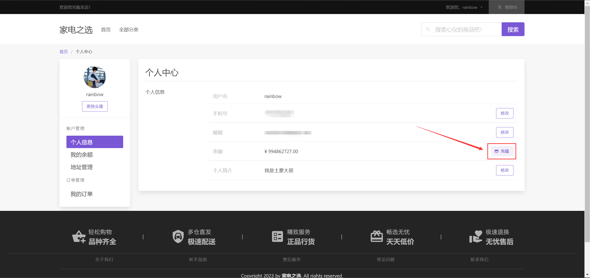

2. 需要验证管理员身份即可完成充值。

*说明：用户余额不能超过999999999.99，这样会充值失败，这是因为设计数据表时，账户余额不能超过这个数，想超过该数量的可以自己去数据库修改相应的字段即可。*

